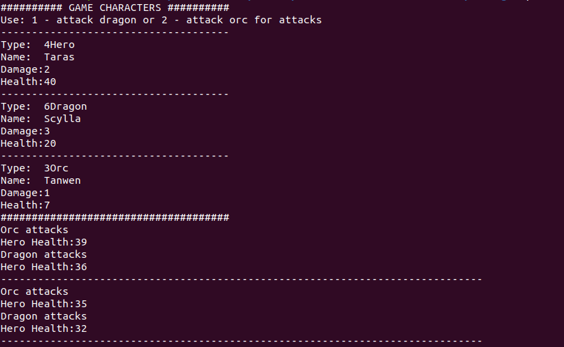
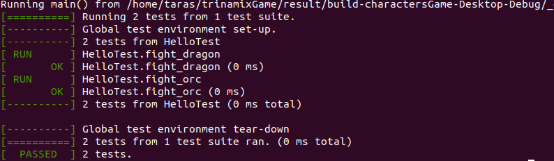

# TrinamixGame
This is a game where a hero fights and an orc or a dragon.

## Usage
Use 1 to attack dragon and 2 to attack orc.
You can type asynchronously the numbers to the input.

## Tests
* test figth dragon
* test fight orc

## Requirements

  * google test
  * cmake

## Images

